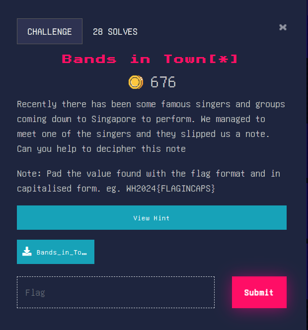
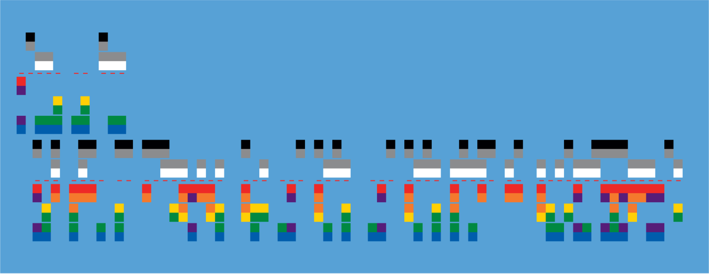
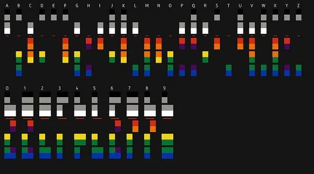

### Bands in Town[*]

Honestly, when I saw the title, I thought it was a network forensics question (network bands). However, it wasn’t so that’s fine I guess.

Image:

This looks very weird, and I’ve never seen anything like this before. Anyway, according to a quick google image search, it seems to be a variation of [Baudot Code](https://en.wikipedia.org/wiki/Baudot_code). Digging further, this seems to be using the Coldplay XY cipher named after their [XY](https://en.wikipedia.org/wiki/X%26Y) album. I managed to find an image online that showed how to encode letters into the coloured cipher. Image:

After some decoding, we get the text “hello to all you must be searching for the flag the flag value is coldplayxycipher”

Flag: WH2024{COLDPLAYXYCIPHER}