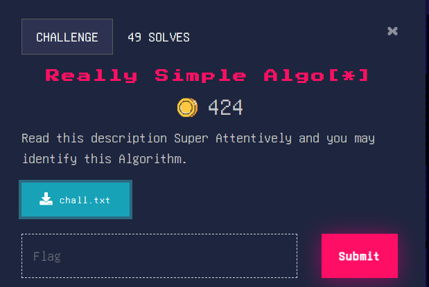
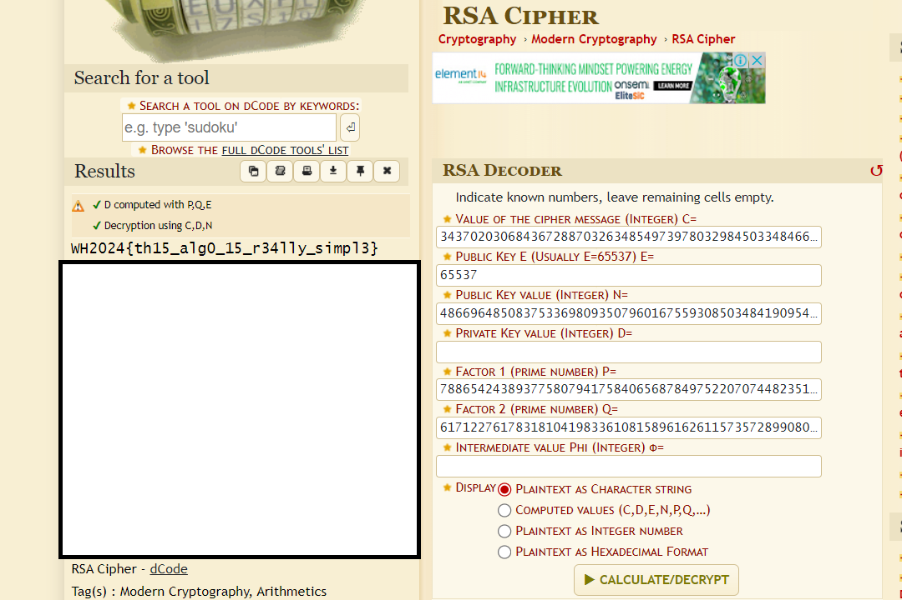

### Really Simple Algo[*]

Judging from the title of this challenge, we need to decrypt an RSA [(Rivest–Shamir–Adleman)](https://en.wikipedia.org/wiki/RSA_(cryptosystem)) encrypted text. Let’s see the values given to us.

p = 78865424389377580794175840656878497522070744823516059929763310335130657053543

q = 61712276178318104198336108158961626115735728990809882884697212881595682247381

e = 65537

ct = 3437020306843672887032634854973978032984503348466065504155397633240945809923068309405041104502857310573065954098228505593605737851805577310690096298267989

Alright, this should be simple enough. Typically in RSA, once we have the values of p,q,e and the ciphertext, we should be good to go. But first, we need to find N, the public key. This is obtained by the multiplication of p and q. 

N = 4866964850837533698093507960167559308503484190954967022748665230368888808965221859893518396665321215536166898737830744407069557885564460357308673888520883

Let’s plug in these values into [https://www.dcode.fr/rsa-cipher](https://www.dcode.fr/rsa-cipher), an online decoder for RSA algorithms. 

Nice, we found the flag! 

Flag: WH2024{th15_alg0_15_r34lly_simpl3}