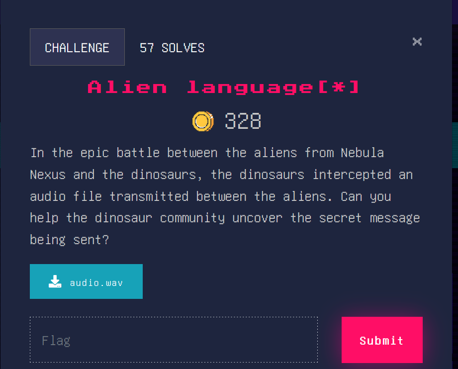
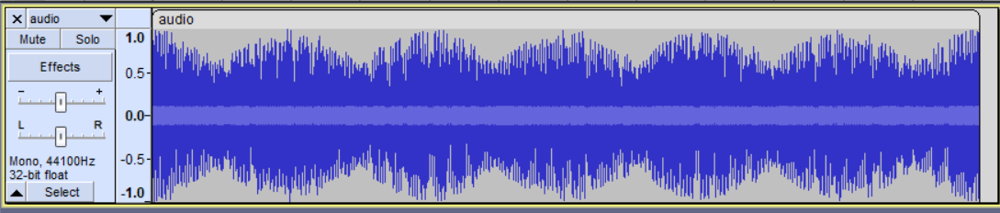
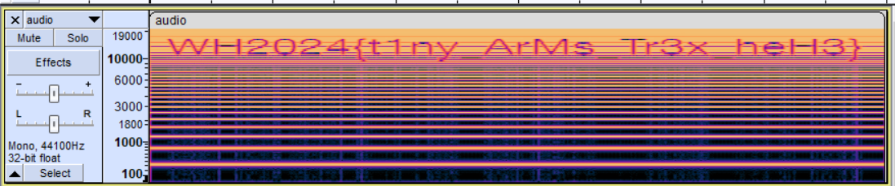

### Alien language[*]

When we download the audio file and listen to it, it sounds gibberish. This is how the audio looks like as a waveform:

Honestly, it looks more like a piece of DNA or a physics diagram than anything meaningful. Let’s try to see the spectrogram for any more clues.

Nice, we found the flag! 

Flag: WH2024{t1ny_ArMs_Tr3x_heH3}