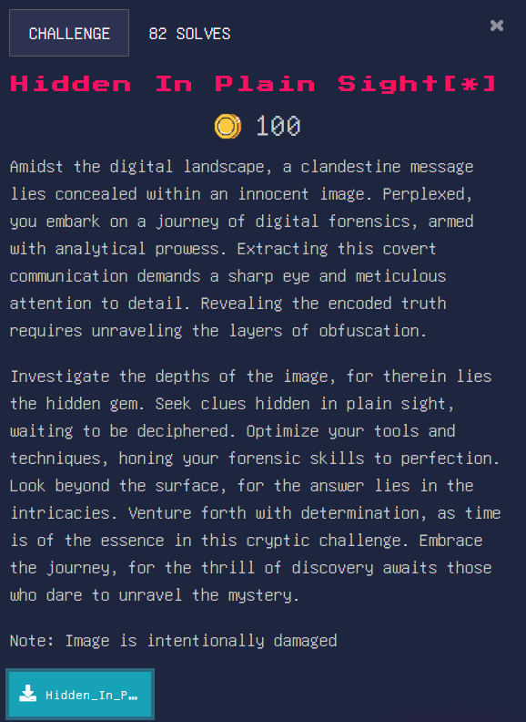
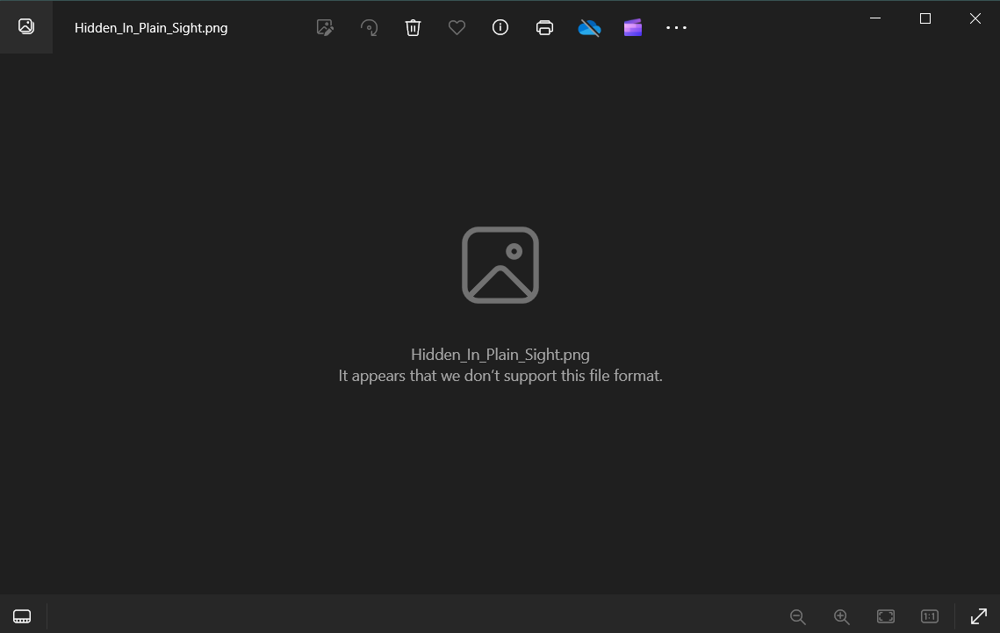

### Hidden In Plain Sight[*]

TLDR: Open document in text editor of your choice (notepad++)

When we try to open the picture normally, we see this: 

So, the flag should be obtainable by either fixing the file header, or checking the contents of the image to see if there’s anything hidden. 

Let’s check the contents of the image.

Interesting, the flag is just there!

Flag: WH2024{d1d_y0u_kn0w_y0u_c0uld_c0nv3r7_4_b453_64_57r1n6_1n70_4n_1m463?}
