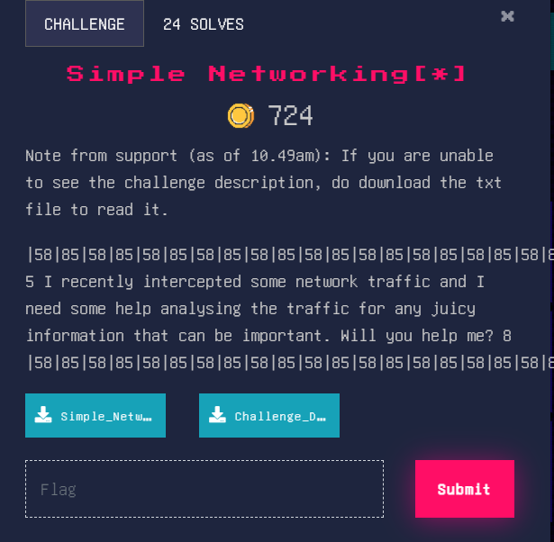
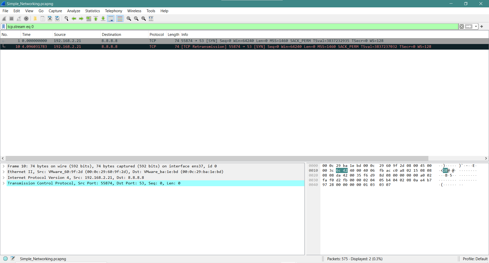
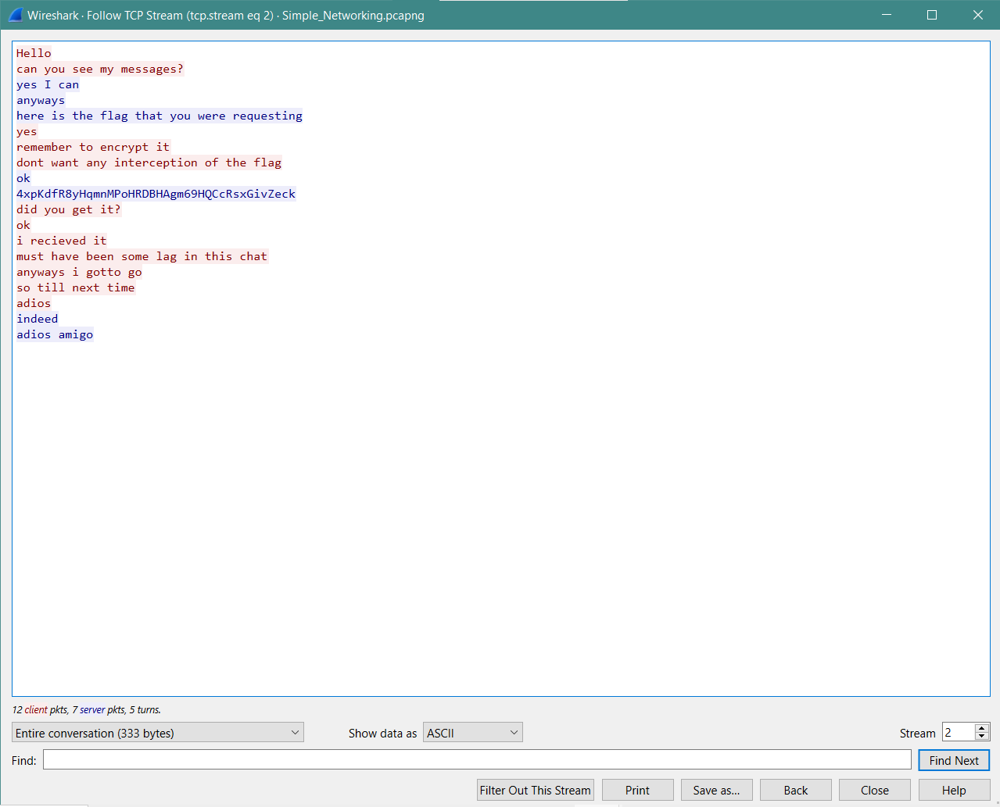
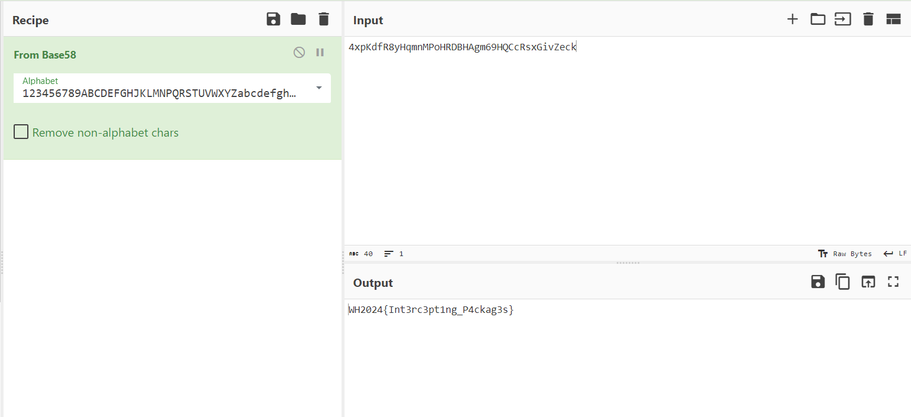

### Simple Networking[*]

Challenge description: 

|58|85|58|85|58|85|58|85|58|85|58|85|58|85|58|85|58|85|58|85|58|85|58|85|58|85|58|85|58|85|58|85|58|85|58|85|58|85|58|85|58|85|58|85|58|85|58|85|58|85|58|85|  

5 I recently intercepted some network traffic and I need some help analysing the traffic for any juicy information that can be important. Will you help me? 8  

|58|85|58|85|58|85|58|85|58|85|58|85|58|85|58|85|58|85|58|85|58|85|58|85|58|85|58|85|58|85|58|85|58|85|58|85|58|85|58|85|58|85|58|85|58|85|58|85|58|85|58|85|

(the 85s and 58s mean nothing lol)

From the files given, we know that they’ve given us a network packet capturer. We use [Wireshark](https://www.wireshark.org/), a network packet analyzer. It will help us find the flag. 

When analysing tcp stream eq 0, we find nothing. However, when we analyse tcp stream eq 2, we find something promising. 

The “flag” seems suspicious. Let’s pass it into Cyberchef to see what we get. 

Nice, we found the flag!

Flag: WH2024{Int3rc3pt1ng_P4ckag3s}