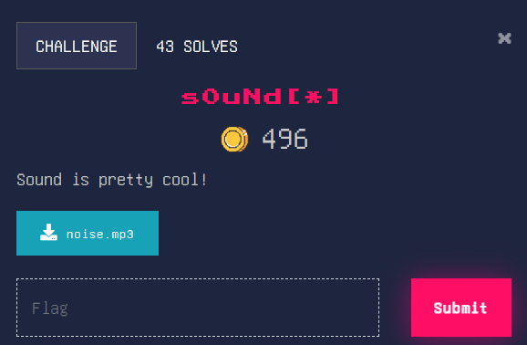
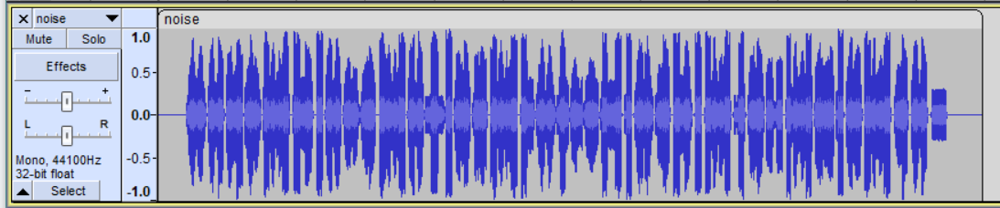
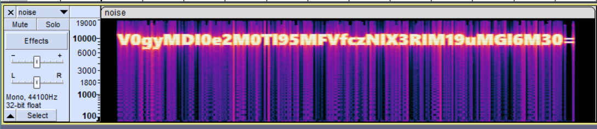
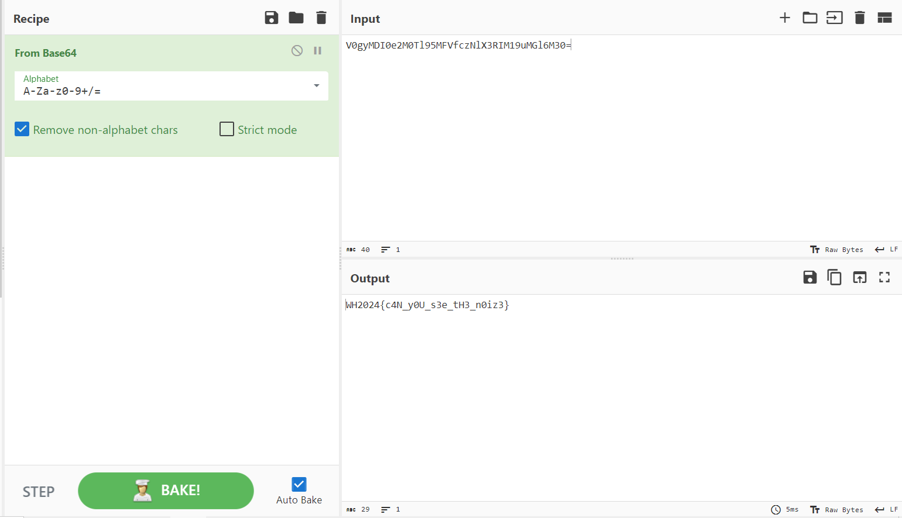

### Sound[*]

Very similar to Alien language[*], in that we need to analyse an audio file. Let’s open it in Audacity again.

More nonsense it is. Let’s try to open the spectrogram in Audacity to find the flag.

Interesting. The flag is encoded in base64 format. It must be decoded first. This will take a while.

Base64 encrypted string: V0gyMDI0e2M0Tl95MFVfczNlX3RIM19uMGl6M30= (it was very guessy). Let’s pass this into [CyberChef](https://gchq.github.io/CyberChef/). 

Flag: WH2024{c4N_y0U_s3e_tH3_n0iz3}