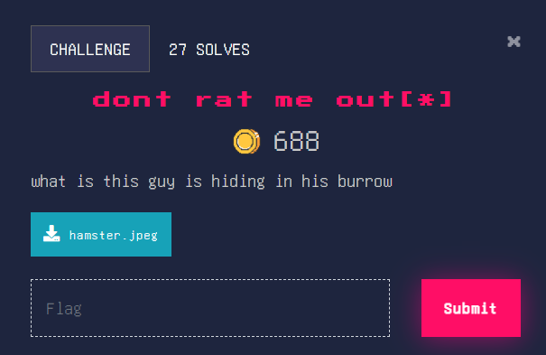
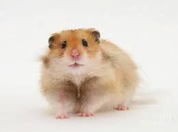
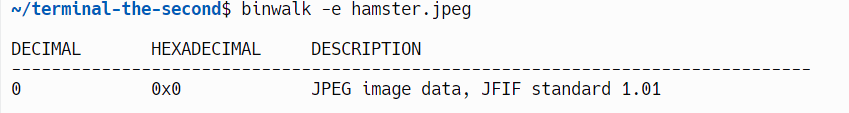
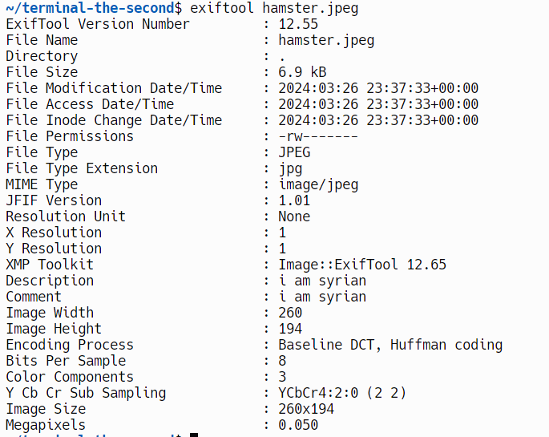
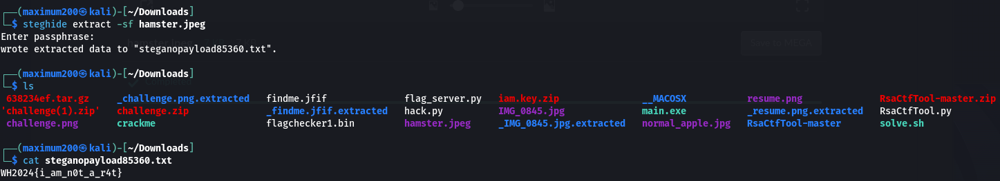

### dont rat me out[*]

We need to find what this hamster is hiding. Image:

Very cute hamster. Let’s use binwalk to check for hidden files. 

Nope, no hidden files. That doesn’t mean that the file is clean. Let’s use [Exiftool](https://exiftool.org/) to check the photo for anything suspicious. 

The comment and description “i am syrian” seem suspicious. We also know that the encoding process is [Huffman coding](https://en.wikipedia.org/wiki/Huffman_coding), which can be used to hide information. Let’s use [steghide](https://steghide.sourceforge.net/) to get the flag!

Nice, we found the flag! Flag: WH2024{i_am_n0t_a_r4t}