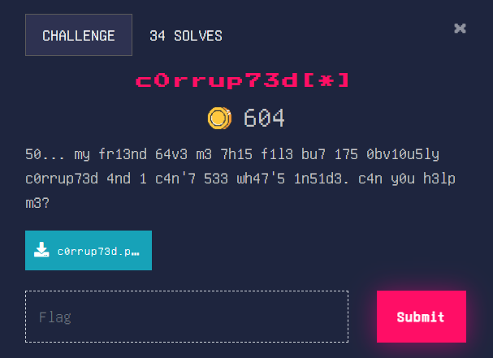
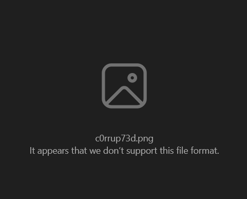
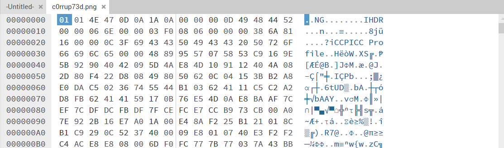
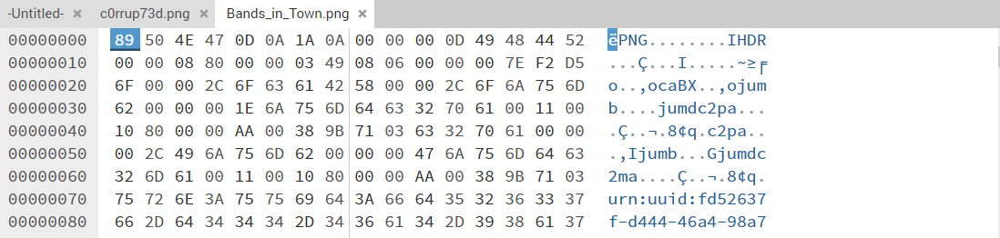
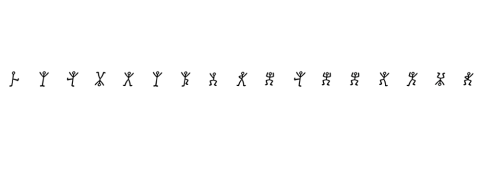
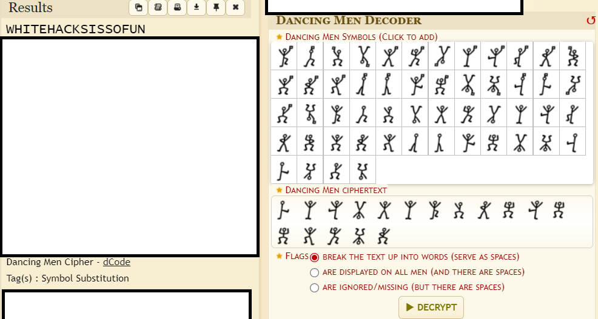

### C0rrup73d[*]

Hmm, let’s try opening the file first. 

We can’t open the file. It must be because the file is corrupted. Let’s open it in [HexEd.it](https://hexed.it/) to check if the file header is damaged.

Yep, we were right. The file header is indeed damaged. 

For reference, a proper file header for a png file is shown below.

Essentially, the first 8 hexadecimal slots of a png file are always 89  50  4e  47  0d  0a  1a  0a. Without this, the file will not work as intended. Let’s correct this and fix the image. 

Fixed image:

Are you kidding me another cipher???

Let’s just continue on. After doing some googling, we find that this is a [dancing men cipher](https://www.arthur-conan-doyle.com/index.php/Dancing_Men_Alphabet). We’ll need to decode this again. We’re using [https://www.dcode.fr/dancing-men-cipher](https://www.dcode.fr/dancing-men-cipher) this time, as it gives us images of the dancing men themselves to click to decode, a huge help. Let’s decode the cipher.

Nice, we found the flag! 

Flag: WH2024{WHITEHACKSISSOFUN}