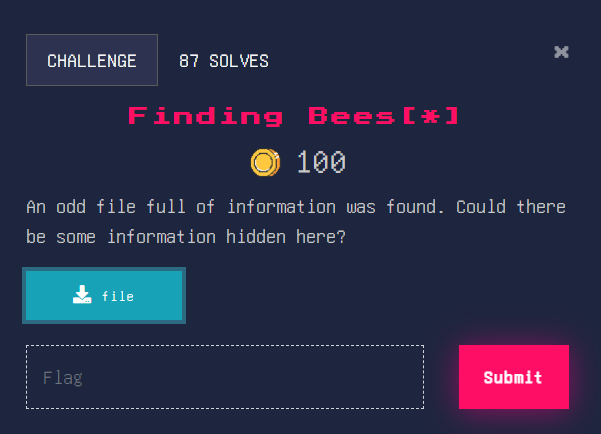
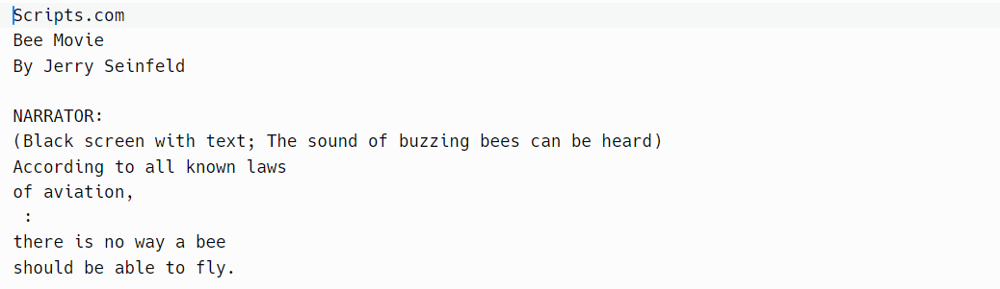

### Finding Bees[*]

Alright, seems like a simple challenge, related to [grep](https://www.digitalocean.com/community/tutorials/grep-command-in-linux-unix), a linux command for searching strings in files. Let’s check out the file contents. 

Why is it the whole bee movie script ☠️

Anyway, we should be able to use grep to find the flag (of course, you could use ctrl-f, but grep is more fun)

Let’s input our command into the shell now.

Huh, that’s it. 

Flag: WH2024{b4rry5_f1rst_gr3p_hr4h3f}
