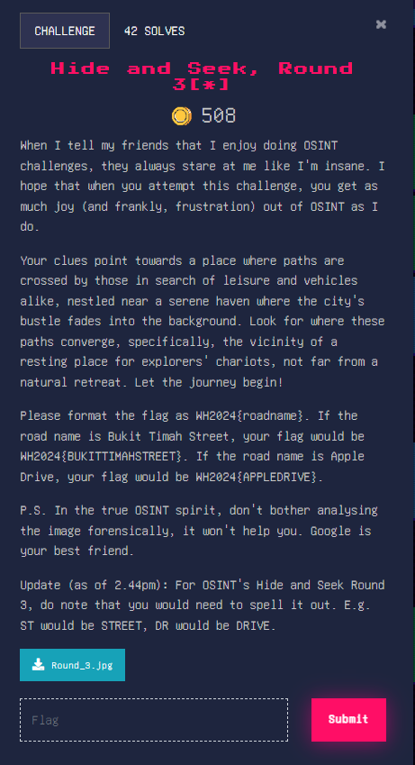
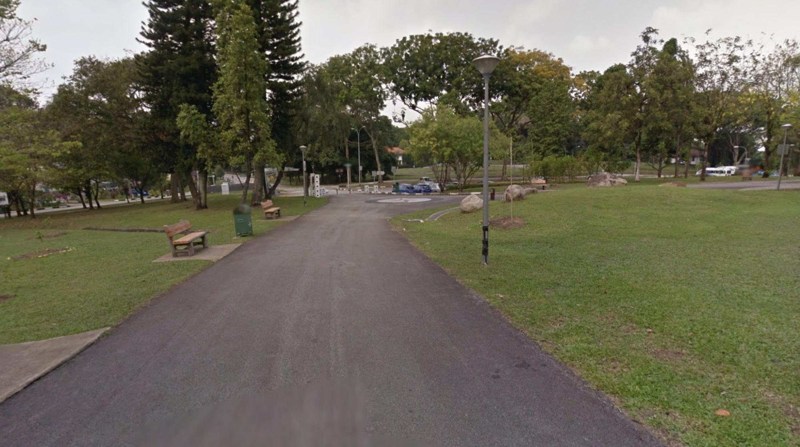
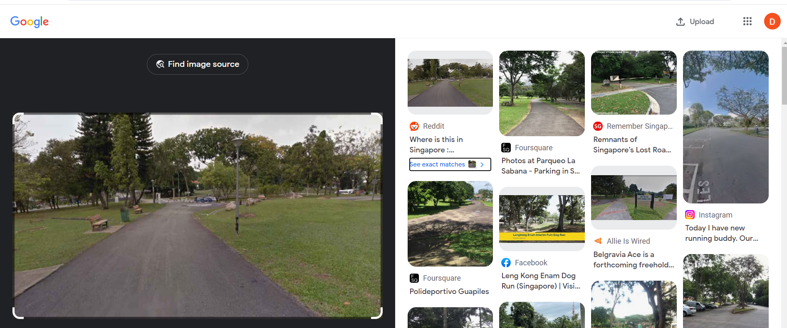
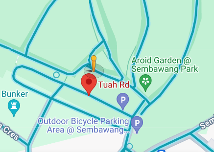

### Hide and Seek, Round 3[*]

This was the hardest OSINT challenge we managed to do.

Image: 

Again, we do our google image search. 

Unfortunately, this time our searches weren't as useful. According to my teammates, the location is at Pasir Ris park. Since we can see cars in the distance and a fork in the footpath, we can narrow it down further to car parks in the vicinity of Pasir Ris park.

From our searches, we narrowed it down to either Pasir Ris Green or Pasir Ris Drive. 

With a bit of guessing, we managed to find the flag.

Flag: WH2024{PASIRRISGREEN} (at least, I hope this is the right one? We couldn’t manage to verify it again)
