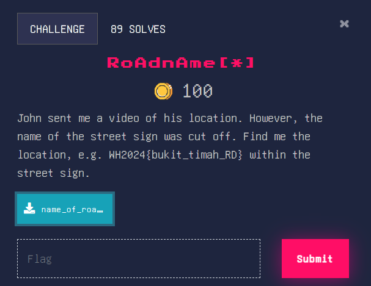
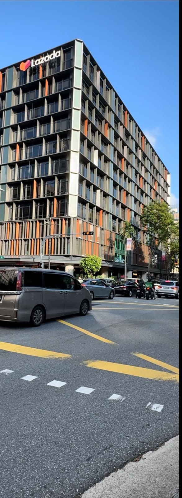
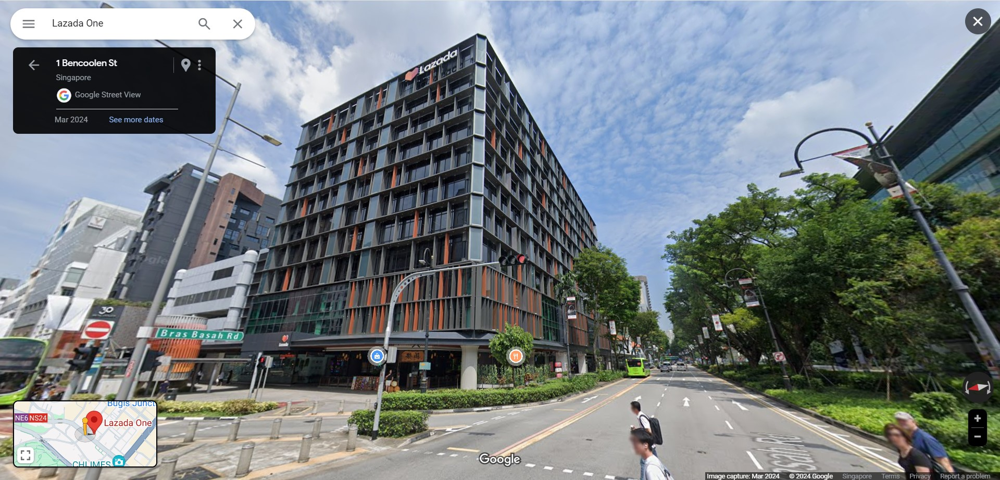

### RoAdnAme[*]

Alright, let’s start by viewing the video.

Hmm, it seems to be near the Lazada building. Let’s check the place on google maps.

However, at the location, there are two street signs, Bras Basah Rd and Bencoolen St. Which one is correct? 

In the earlier video, towards the middle left of the video, the letters “Rd” can be seen on the sign. This tells us the road name is Bras Basah Rd. 

Flag: WH2024{Bras_Basah_Rd}
