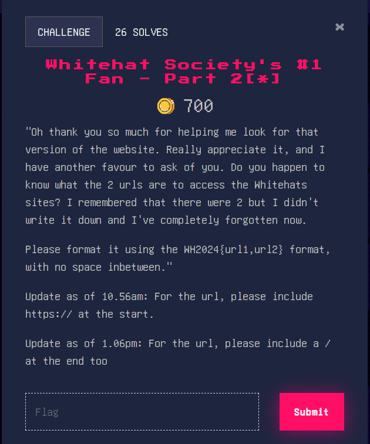

### Whitehat Society’s #1 Fan - Part 2[*]

We already know the first url, [https://whitehats.sis.smu.edu.sg/](https://whitehats.sis.smu.edu.sg/). Since the SMU domains normally have the school name inside as well, it would make sense if the other url would also contain scis (School of Computing and Information Systems) as well. When we do a search, it also works! ([https://whitehats.scis.smu.edu.sg/](https://whitehats.scis.smu.edu.sg/))

Flag: WH2024{[https://whitehats.sis.smu.edu.sg/](https://whitehats.sis.smu.edu.sg/) ,[https://whitehats.scis.smu.edu.sg/](https://whitehats.sis.smu.edu.sg/))