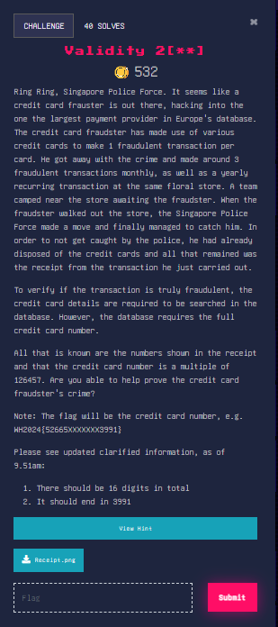
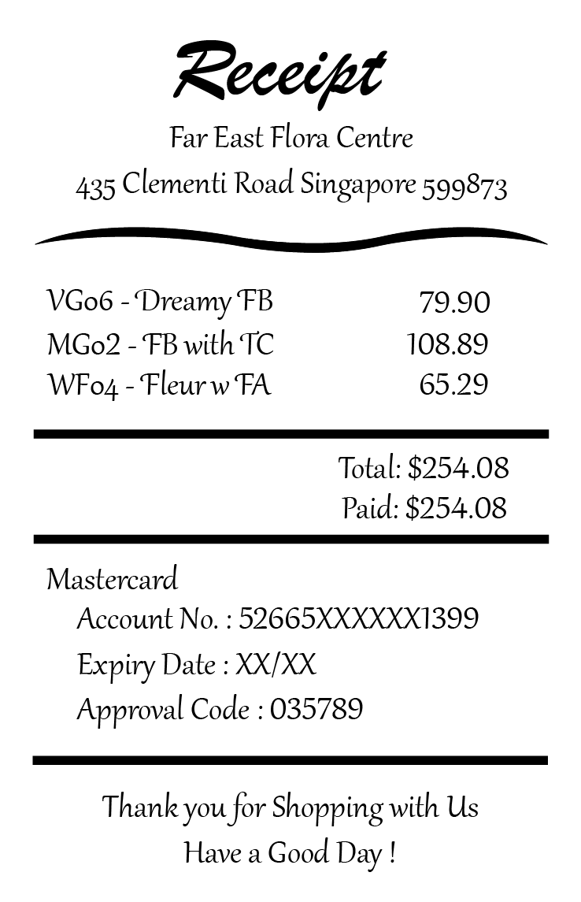

### Validity 2[**]





I managed to get third blood on this one!

Image:





Alright, this looks like a credit card algorithm solver. Here’s the information we have:


1. Credit card is 16 digits long
2. First 5 numbers are 52665
3. It ends in 3991
4. The credit card is a multiple of 126457

We’ll need to use the Luhn algorithm for this. The python solve script is shown below:


```python
def get_check_digit(first_15_digits):
    """
    Finds the check digit of a credit card number
    """
    total = 0 ##set total variable
    for i in range(len(first_15_digits)): ##We assume that the data has been validiated already, and only numbers are present
        if i % 2 == 0: ##odd placement in actual credit card 
            temp = int(first_15_digits[i]) * 2 ##double value of alternate digits
            
            if len(str(temp)) != 1: ##if it is a two digit number
                temp2 = 0 ##set another temp variable
                
                for j in range(len(str(temp))): ##add individual digits together
                    temp2 += int(str(temp)[j]) 
                total += temp2
                
            else: ##single digit number
                total += temp
        else: ##not alternate digit
            total += int(first_15_digits[i])
    remainder = total % 10 ##find remainder
    check_digit = 10 - remainder ##get check digit
    return check_digit

def checkValid(input_value):
    """
    Checks whether a credit card number is valid or invalid
    """
    first_15_digits = input_value[0:15] ##use string slicing to extract digits
    check_digit = get_check_digit(first_15_digits) ##find the check digit
    if check_digit == int(input_value[-1]): ##if the check digit matches
        return True, input_value
    else:
        return ""
    
    
for i in range(1000000, 10000000):
    creditNo = "52665" + str(i) + "3991"
    if int(creditNo) % 126457 == 0: ##if divisible by 126457
        print(checkValid(creditNo))

##Output:
(True, '5266515434713991')
(True, '5266538196973991')
(True, '5266557165523991')
(True, '5266559694663991')
(True, '5266560959233991')
(True, '5266569811223991')
(True, '5266591308913991')
(True, '5266592573483991')
(True, '5266593838053991')
```


Flag: One of the following flags below (very guessy)

WH2024{5266515434713991}

WH2024{5266538196973991}

WH2024{5266557165523991}

WH2024{5266559694663991}

WH2024{5266560959233991}

WH2024{5266569811223991}

WH2024{5266591308913991}

WH2024{5266592573483991}

WH2024{5266593838053991}