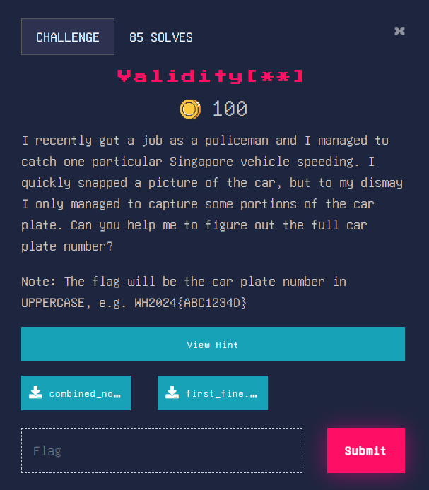

### Validity[**]





Alright, let’s see what information we have. 

Image: 


Combined notes: 

-----------------------------------------------------

|              Notes on car remembered              |

-----------------------------------------------------

1. The sum of all the numbers in the car plate is 21

2. The product of the numbers in the car plate is 216

3. Of all the numbers, none of them are a duplicate

4. All missing letters on the car plate is a consonant

Car plate: SE_8_1_G

From simple maths, the missing numbers are 3 and 9 (3+8+1+9=21, 3*8*1*9=216)

We also know that the 1st slot is a consonant. Let’s find the checksum for Singaporean car plate numbers. 

We will use the checksum shown here [https://en.wikipedia.org/wiki/Vehicle_registration_plates_of_Singapore#Checksum](https://en.wikipedia.org/wiki/Vehicle_registration_plates_of_Singapore#Checksum) to validate our car plate number. 

Python code used: 


```python
##lists of characters to check against
alphabets = ['A', 'B', 'C', 'D', 'E', 'F', 'G', 'H', 'I', 'J', 'K', 'L', 'M', 'N', 'O', 'P', 'Q', 'R', 'S', 'T', 'U', 'V', 'W', 'X', 'Y', 'Z']
checksum = ['A', 'Y', 'U', 'S', 'P', 'L', 'J', 'G', 'D', 'B', 'Z', 'X', 'T', 'R', 'M', 'K', 'H', 'E', 'C']

def returnCheckDigit(plate):
    """
    Takes in a car plate number with 3 letters in front, and validates it by outputting a check digit.
    """
    ##get indexes of words
    index_1 = alphabets.index(plate[1]) + 1
    index_2 = alphabets.index(plate[2]) + 1
    ##checksum: 14, 2, 12, 2, 11, 1 in order mod 19, compare with checksum array to get check digit
    total = 14 * index_1 + 2 * index_2 + 12 * int(plate[3]) + 2 * int(plate[4]) + 11 * int(plate[5]) + int(plate[6])
    checkDigit = total % 19
    return checksum[checkDigit]

for i in alphabets:
    ## two possible cases for the numbers in the car plate
    case_1_temp = f"SE{i}8319"
    case_2_temp = f"SE{i}8913"
    if returnCheckDigit(case_1_temp) == 'G':
        print(case_1_temp+"G")
    if returnCheckDigit(case_2_temp) == 'G':
        print(case_2_temp+"G")

##Output:
SEI8913G
SEL8319G
```


However, since the missing letter cannot be a vowel, the real car plate number cannot be SEI8913G. Thus, it must be the other car plate number.

Flag: WH2024{SEL8319G}