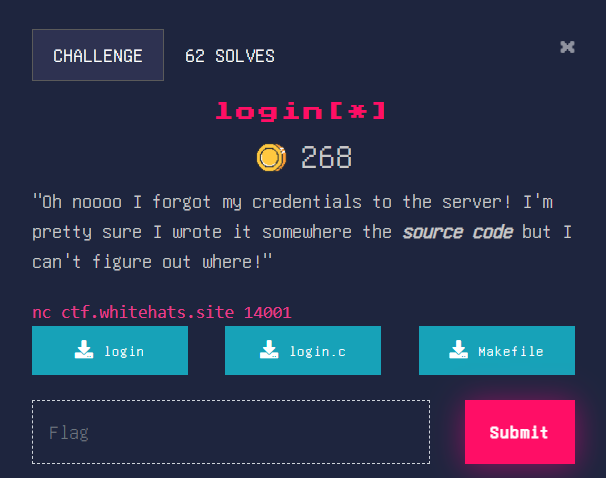

### Login [*]





Code for login.c: 


```c
#include <stdio.h>
#include <string.h>
#include <stdlib.h>

#define FLAGSIZE 64

void print_flag(){
	char flag[FLAGSIZE];

	FILE *f = fopen("flag.txt","r");
	if (f == NULL) {
		printf("Flag File is Missing.\n");
		exit(0);
	}

	fgets(flag,FLAGSIZE,f);
	printf(flag);
}

int main(int argc, char** argv) {
	setvbuf(stdout, NULL, _IONBF, 0);

	char buffer[32] = {0x00};

	printf("%s", "Login: ");
	fgets(buffer, sizeof(buffer), stdin);

	if (strcmp(buffer, "Weje\n") == 0){
		printf("%s", "Password: ");
		fgets(buffer, sizeof(buffer), stdin);

		if (strcmp(buffer, "P@SSW0RD\n") == 0){
			printf("%s\n", "Login passed! Here is your flag.");
			print_flag();
		} else {
			printf("%s\n", "Invalid password!");
		}
	} else {
		printf("%s\n", "Invalid Username.");
	}

}
```


From this we know that username = Weje, and password = P@SSWORD

So just pass these into the netcat


Done! Flag: WH2024{L0g1n_successf00l}