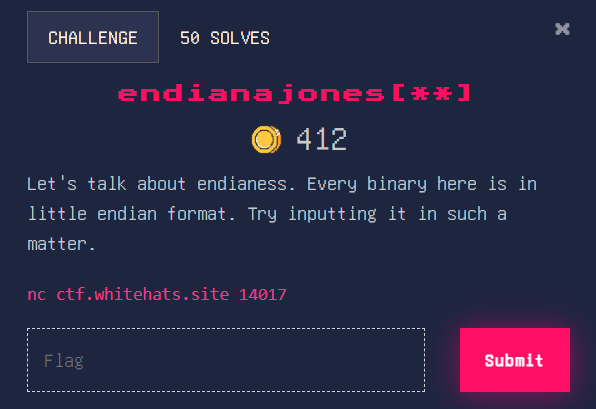
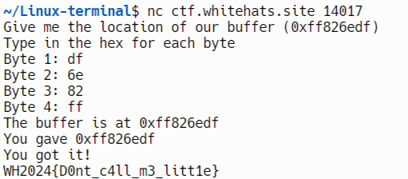

### endianajones[**]

Little endian is basically a way that computers store numbers, and they do so in chunks of 2, starting from the right to the left. So, a string named “ab2cd4ef” would be stored in little endian format as ef d4 2c ab. For more information, visit [Endianness - Wikipedia](https://en.wikipedia.org/wiki/Endianness). 

Flag: WH2024{D0nt_c4ll_m3_litt1e}