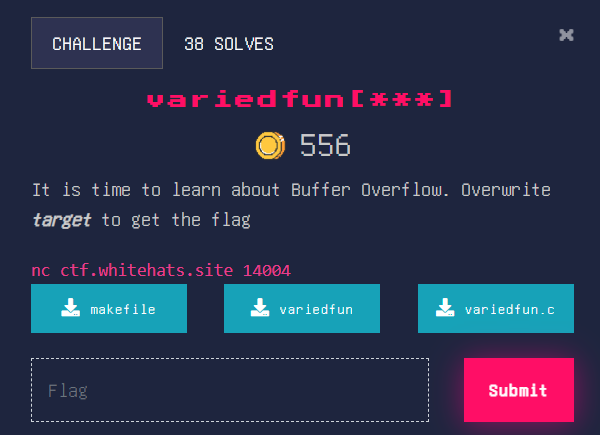
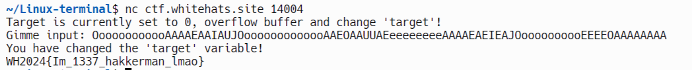

### variedfun[***]





Code for variedfun.c: 


```c
#include <unistd.h>
#include <stdio.h>
#include <stdlib.h>

#define FLAGSIZE 64

char flag[FLAGSIZE];

void win(){
	FILE *f = fopen("flag.txt","r");
	if (f == NULL) {
		printf("Flag File is Missing.\n");
		exit(0);
	}

	fgets(flag,FLAGSIZE,f);
	printf(flag);

	return;
}

int main(int argc, char **argv){
	setvbuf(stdout, NULL, _IONBF, 0); // clears standard output, you don't need to know this 

	volatile int target; // this guy here is one you want to change
	char buffer[64] = {0x00}; // this guy here can fit 64 characters

	target = 0;
	
	printf("Target is currently set to %d, overflow buffer and change 'target'!\n", target);
	printf("Gimme input: ");
	gets(buffer); // gets is an insecure function that allows you to input as many characters as you want to buffer.

	if (target != 0) {
		printf("You have changed the 'target' variable!\n");
		win();
	} else {
		printf("Nope, target is still %d\n", target);
	}
}
```


Quite a guided challenge in my opinion. Our only goal here is to make buffer non zero, so an input of anything very large should do the trick.





If you know the reference good for you

Flag: WH2024{Im_1337_hakkerman_lmao}
