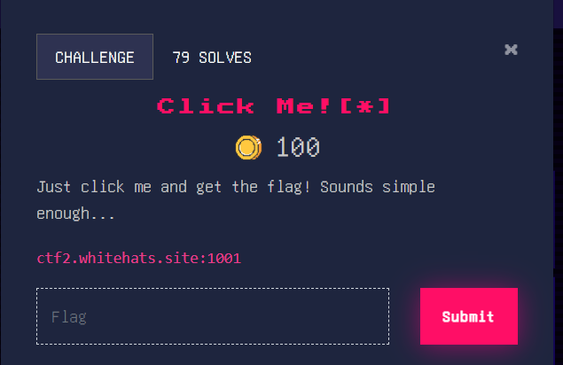
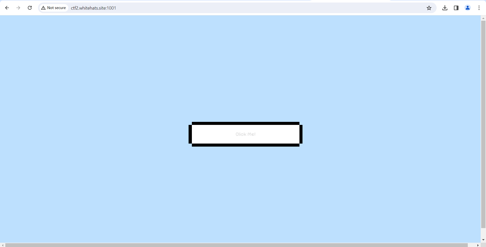
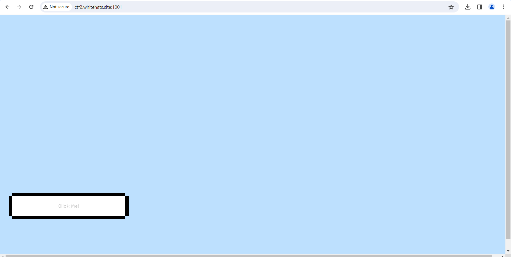
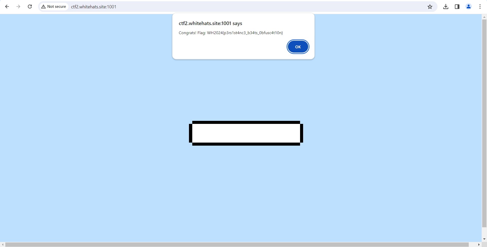
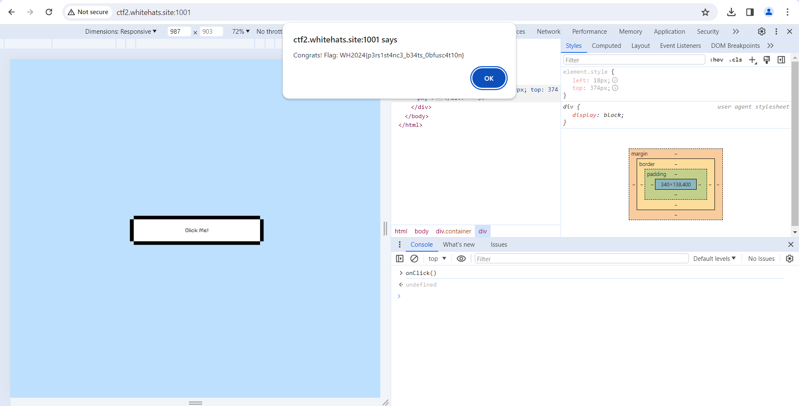

### Click Me! [*]





The entire aim of the website is to be able to click the button, which is just laying there





However it keeps moving about and around, making our lives harder





Our solution for this is simple: Go into the web inspector and see how the website works.


Upon closer inspection, we see that the function that we are supposed to click, onClick() is unclickable due to the div wrapping it with the class ‘movingDiv’. We have 3 solutions to combat this. The first is to simply remove the movingDiv class, allowing us to click the button. 





The second is to directly call the onClick() function from the console. This yields the same result. 



The third and more time consuming solution is to deobfuscate the javascript code, which is time consuming, but let’s do it for fun.

Obfuscated code: 


```javascript
const _0x8ec7f2=_0x3b3e;function _0x2b09(){const _0x45f49d=['innerHeight','8TcMmZy','142770URSLup','818898vFJvMo','1338dbNeQi','innerWidth','206030fCLfoy','getElementById','2552rPvsNS','addEventListener','mouseover','143075hlCMgw','13387693jslPEd','/Z2V0X2ZsYWc=','1094604abVJSA','random','style','floor','left','54npkBsF','12qIoKls','then'];_0x2b09=function(){return _0x45f49d;};return _0x2b09();}(function(_0x3eba40,_0x1985b2){const _0x124f62=_0x3b3e,_0x548083=_0x3eba40();while(!![]){try{const _0x3c84bb=-parseInt(_0x124f62(0x14c))/0x1+-parseInt(_0x124f62(0x14d))/0x2+parseInt(_0x124f62(0x14e))/0x3*(-parseInt(_0x124f62(0x152))/0x4)+parseInt(_0x124f62(0x155))/0x5*(-parseInt(_0x124f62(0x148))/0x6)+-parseInt(_0x124f62(0x142))/0x7*(parseInt(_0x124f62(0x14b))/0x8)+parseInt(_0x124f62(0x147))/0x9*(parseInt(_0x124f62(0x150))/0xa)+parseInt(_0x124f62(0x156))/0xb;if(_0x3c84bb===_0x1985b2)break;else _0x548083['push'](_0x548083['shift']());}catch(_0x347be3){_0x548083['push'](_0x548083['shift']());}}}(_0x2b09,0x46e08));const buttonWidth=0x140,buttonHeight=0x50,maxWidth=window[_0x8ec7f2(0x14f)]-buttonWidth,maxHeight=window[_0x8ec7f2(0x14a)]-buttonHeight;function _0x3b3e(_0xca8f0f,_0xe976d1){const _0x2b095a=_0x2b09();return _0x3b3e=function(_0x3b3eae,_0x36aa5f){_0x3b3eae=_0x3b3eae-0x142;let _0x36e40f=_0x2b095a[_0x3b3eae];return _0x36e40f;},_0x3b3e(_0xca8f0f,_0xe976d1);}document[_0x8ec7f2(0x153)]('DOMContentLoaded',function(){const _0x58a8b7=_0x8ec7f2,_0x55da3e=document[_0x58a8b7(0x151)]('movingDiv');_0x55da3e[_0x58a8b7(0x153)](_0x58a8b7(0x154),function(_0x15e382){const _0x2269a7=_0x58a8b7;_0x55da3e['style'][_0x2269a7(0x146)]=Math[_0x2269a7(0x145)](Math[_0x2269a7(0x143)]()*(maxWidth+0x1))+'px',_0x55da3e[_0x2269a7(0x144)]['top']=Math['floor'](Math[_0x2269a7(0x143)]()*(maxHeight+0x1))+'px';});});function onClick(){const _0x459ee8=_0x8ec7f2;fetch(_0x459ee8(0x157))[_0x459ee8(0x149)](_0x2422ff=>_0x2422ff['text']())[_0x459ee8(0x149)](_0x569734=>alert('Congrats!\x20Flag:\x20'+_0x569734));}
```


When passing it through an deobfuscator online (I use [Obfuscator.io Deobfuscator](https://obf-io.deobfuscate.io/)), we get the following code:


```javascript
const maxWidth = window.innerWidth - 0x140;
const maxHeight = window.innerHeight - 0x50;
document.addEventListener('DOMContentLoaded', function () {
  const _0x55da3e = document.getElementById('movingDiv');
  _0x55da3e.addEventListener("mouseover", function (_0x15e382) {
    _0x55da3e.style.left = Math.floor(Math.random() * (maxWidth + 0x1)) + 'px';
    _0x55da3e.style.top = Math.floor(Math.random() * (maxHeight + 0x1)) + 'px';
  });
});
function onClick() {
  fetch("/Z2V0X2ZsYWc=").then(_0x2422ff => _0x2422ff.text()).then(_0x569734 => alert("Congrats! Flag: " + _0x569734));
}
```


All this does is lead you back to the 2nd solution, making this a more inefficient and time wasting one (but it works though).

Flag: WH2024{p3rs1st4nc3_b34ts_0bfusc4t10n} indeed