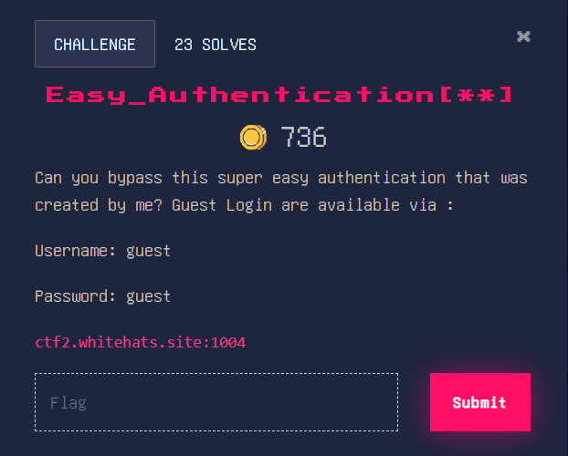
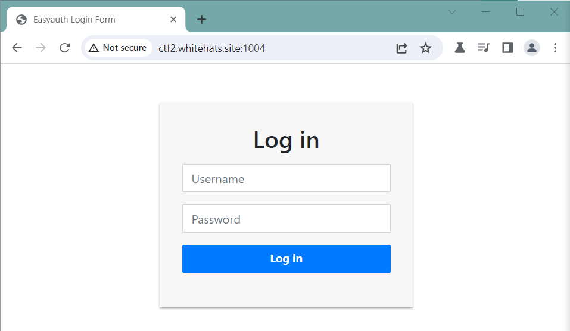
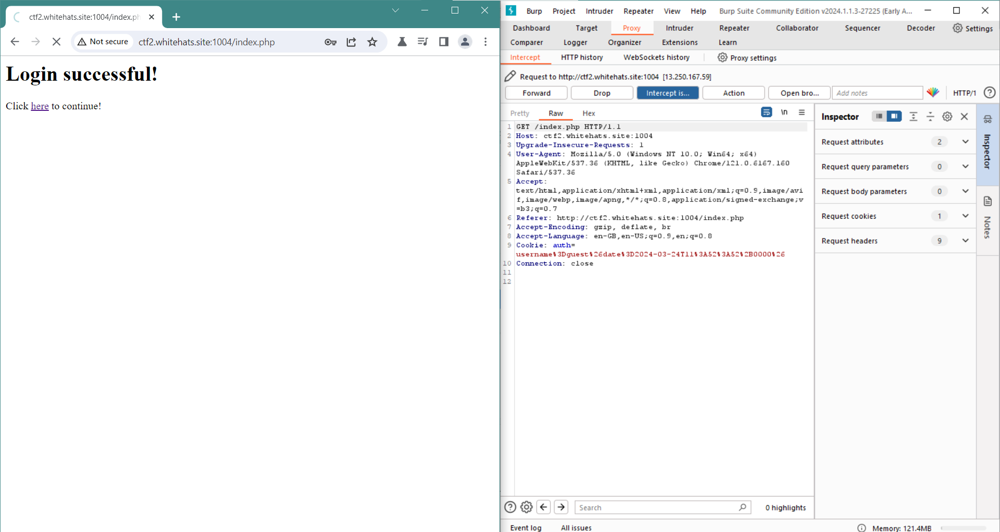
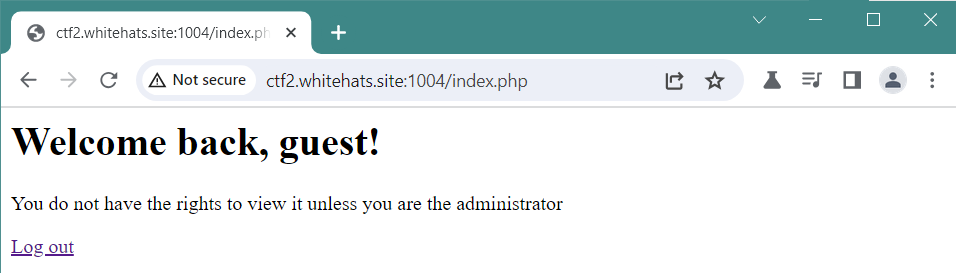
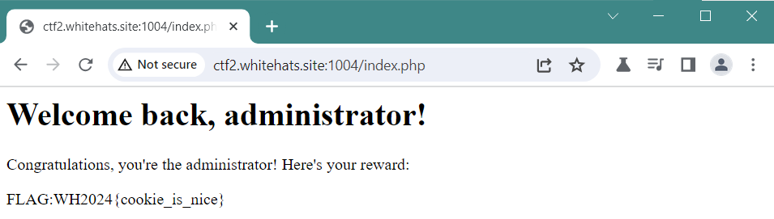

### Easy_Authentication[**]

This was an easy but tricky one. Took me a while to figure it out. We’ll be using burp suite this time round. 

Website appears normal, nothing abnormal showed up on the scans as well. Let’s sign in as the guest account.

After logging in, we see this screen. Now when we turn on intercepting traffic, we can see mostly normal data, except for the cookie. It’s in the format “username: xxx , date: yyy”. We’ll be exploiting this cookie later to get our flag. 

Aw man, it blocks us from getting the flag. Clicking log out will only bring us back to the home landing page. What if we changed the earlier cookie however, to make our username administrator. It can’t be that easy, right?

It was that easy. 

Flag: WH2024{cookie_is_nice}