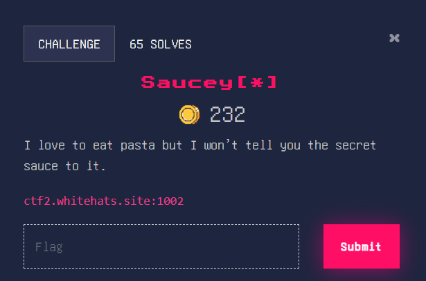
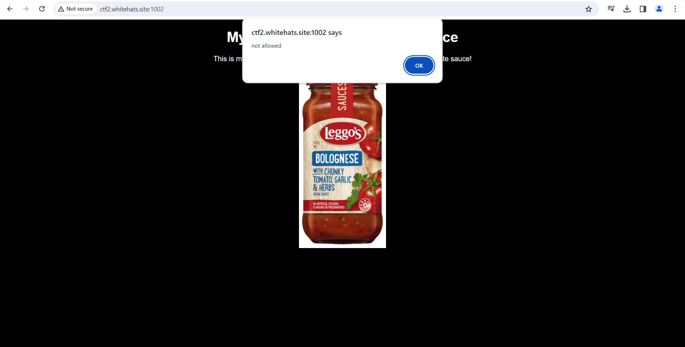
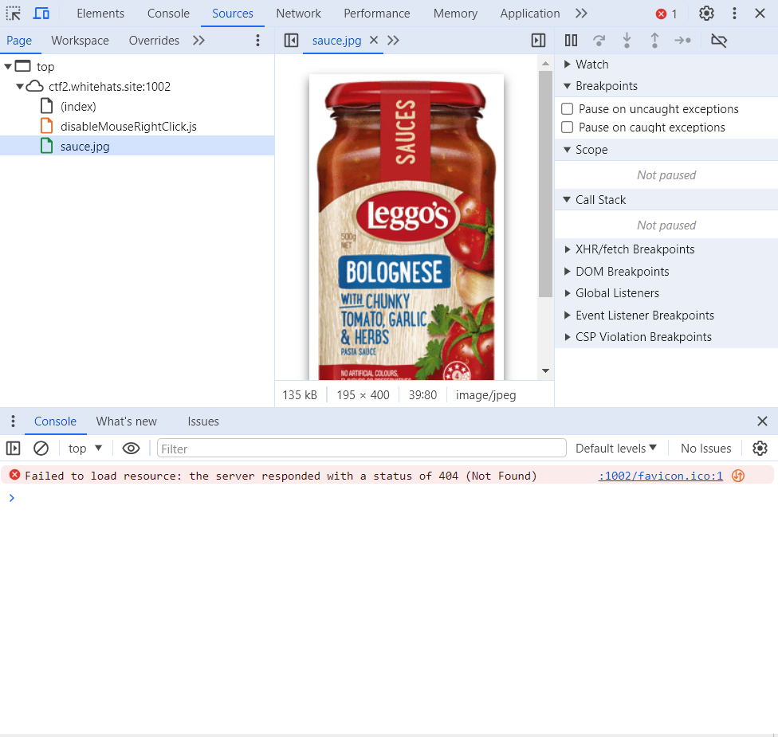
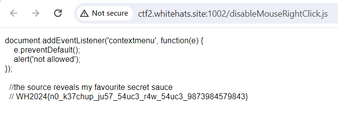

### Saucey[*]

If we try to right-click on this website, it returns this error message: 

Smart, I should implement that someday. However, ctrl+shift+i still works so let’s use it

Nice sauce. Let’s see the other elements of the webpage for any clues.

The flag is in the JS file! 

Flag: WH2024{n0_k37chup_ju57_54uc3_r4w_54uc3_9873984579843}