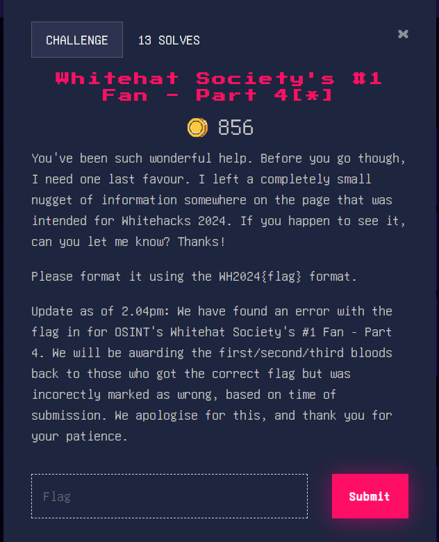
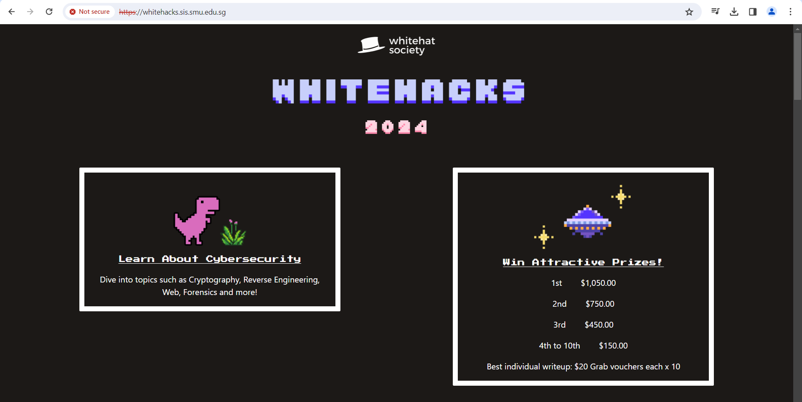
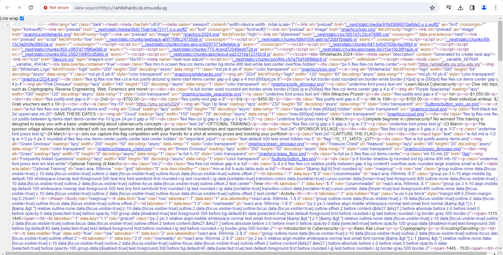
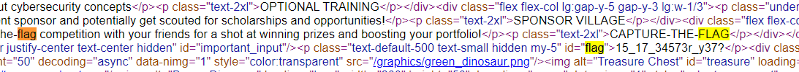

### Whitehat Society's #1 Fan - Part 4[*]

The web part of the 4-part long OSINT challenge. Nice trick. There isn’t much ‘web’ part of the challenge, mostly just where to look. From the challenge description, “I left a completely small nugget of information somewhere on the page that was intended for Whitehacks 2024”. This tells us that we should look at the original Whitehacks 2024 website, [https://whitehacks.sis.smu.edu.sg/](https://whitehacks.sis.smu.edu.sg/) for the flag. 

Website looks pretty normal, but that one “not secure” sign makes me think something’s hidden on the website. Let’s check the page source.

Wow, that’s a lot of text! How are we supposed to find the flag now? Let’s just search for “flag” first, maybe that’ll give us some clues.

Thanks to our trusty ctrl-f, we managed to find some occurrences of the word “flag” in the website. However, the third one seems suspicious. Why is it in a &lt;p> tag that has a hidden class? It must be the flag!

Flag: WH2024{15_17_34573r_y37?} (yes, that was the flag, honestly easier than the other OSINT questions)
